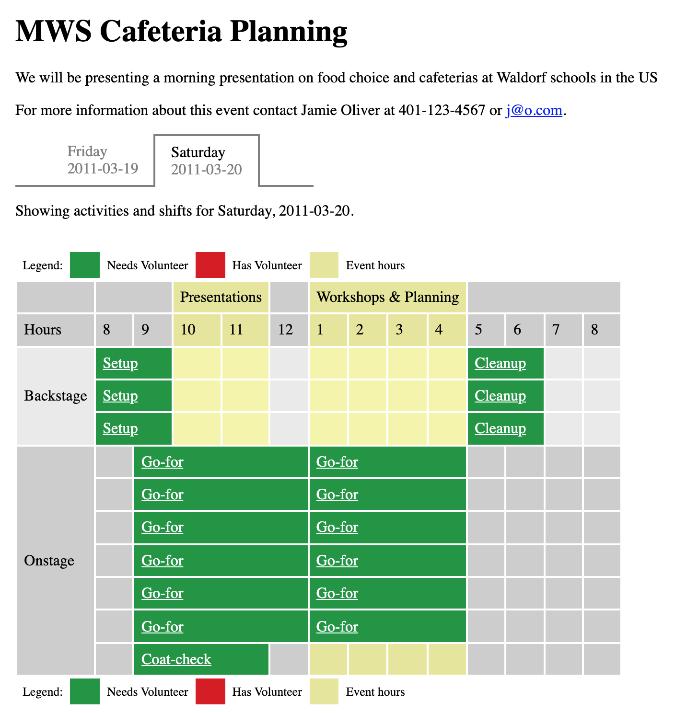

# Volunteer Signup Application

This application was written to support the [Meadowbrook Waldorf](https://www.meadowbrookschool.com/) school's annual holiday fair. This fair is a multi-day event with many activities and much need of volunteers. The school was using a Google sheet before, and it was not going well. This application was written over a few weeks and was the author's only PHP application.

Here is an example of a small event happening over two days. The first day has set up activities and the second day is broken up into morning presentations and afternoon workshops.

The requirements for the application were changing as I built it. It was also unlikely that anyone other than me would be the "administrator" of it. Instead of creating a weak administrative interface I choose to create a language for desribing events and wrote an interpreter to translate that description into the actionable interface. Updating the langangue and interpreter was far faster than would have been the case with updating an administrative interface. The small event above is described

	event "MWS Cafeteria Planning"

	    contact "Jamie Oliver"
    
	    description "We will be presenting a morning presentation on food choice 
	                 and cafeterias at Waldorf schools in the US"
    
	    day "Friday"
	        date 2011-03-19
	    end
    
	    day "Saturday"
	        date 2011-03-20
	        hours "Presentations"
	            starting 10AM
	            ending 12PM
	        end
	        hours "Workshops & Planning"
	            starting 1PM
	            ending 5PM
	        end
	    end
    
	    role "Cleanup"
	    end
    
	    role "Setup"
	    end
    
	    role "Coat-check"
	    end
    
	    role "Go-for"
	    end
    
	    activity "Backstage"
	        day "Friday"
	            shift "Setup"
	                count 3
	                starting 6PM
	                ending 8PM
	            end
	            shift "Setup"
	                count 3
	                starting 8AM
	                ending 10AM
	             end
	        end
	        day "Saturday"
	            shift "Setup"
	                count 3
	                starting 8AM
	                ending 10AM
	            end
	            shift "Cleanup"
	                count 3
	                starting 5PM
	                ending 7PM
	            end
	        end
	    end

	    activity "Onstage"
	        day "Saturday"
	            shift "Go-for"
	                count 6
	                starting 9AM
	                ending 1PM
	            end
	            shift "Go-for"
	                count 6
	                starting 1PM
	                ending 5PM
	            end
	            shift "Coat-check"
	                starting 9AM
	                ending 12PM
	            end
	        end
	    end
    
	end

## Installation

To install the application you will need a PHP server, commonly an Apache HTTP Server with the PHP 8 module, and a MySql database server.

The application is installed by adding it to your web servers document root. Since the name of the directory containing the application is not significant to its operation (see [site-include.php](site-include.php)) name the directory whatever seems appropriate for your organization.

To prepare the database, connect to the database server and execute the [install.sql](install.sql). This will create the `signup` database and `signup` user with password `signup`. Change these as needed.

Next update the [site-include.php](site-include.php) file with the database and the other configuration details. The "magicnumber" is used to protect unauthorized creation of events. Use a value that is obscure but easy to copy and paste from an email! I use a UUID created using `uuidgen`.

	<?php

	$magicnumber = '5D555ECE-1014-4EAA-B9F3-5225E887CB9F';
	$database_address = '127.0.0.1:3306';
	$database_name = 'signup';
	$database_user = 'signup';
	$database_password = 'signup';
	$base_href = "http://localhost/mws_signup/";

	?>

You can now list events and create new ones at

	http://localhost/mws_signup/

For details on scripting an event see

    http://localhost/mws_signup/create-event-help-page.php

END
